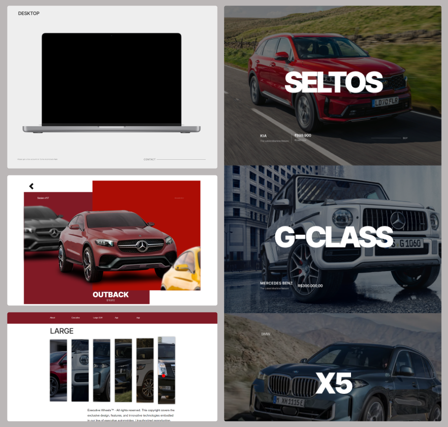

# A Turma automóveis

A website made by [HuannAnd](https://github.com/HuannAnd) and [Koioto13224](https://github.com/Koioto13224)

## Why build this project?

The ideia is build a modern and resposive, website, using **Next.js, Scss, Figma, Java Spring Boot**, to study.

## Some of observations about this Website

1 - Apesar de os carros possuirem preço, não é possível a compra dos mesmos.

2 - Contact section doesnt work

## Contact / Feedback 🙌

Por favor, caso queira nos contatar, ou reportar sobre algum erro, ou evidenciar alguma melhora, segue abaixo os contatos:

- Email to me:

  - [huannvicente14@outlook.com](mailto:huannvicente14@outlook.com)

- Connect with us on Linkedin:
  - [HuannAnd](https://www.linkedin.com/in/huann-vicente-5092a9261/)
  - [Koioto13224]()

## Functionalities

<!-- - FrontEnd -->

- página que exibe uma lista de carros disponíveis.
- página que exibe os detalhes de um carro selecionado.
- formulário de contato para os usuários solicitarem mais informações sobre um carro.
- página com um formulário para agendar um test drive.

## Production

The website will be deployed, soon.
